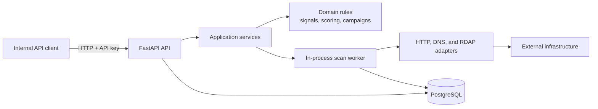

# Arkana Threat Intelligence

**Map the attack. Not just the URL.**

Arkana is a phishing intelligence platform that detects, clusters, and tracks phishing campaigns by analyzing infrastructure reuse, page similarity, and domain behavior.

Instead of answering:
> “Is this URL malicious?”

Arkana answers:
> “What campaign is this part of, how is it evolving, and what infrastructure is behind it?”

---

## Why Arkana Exists

Modern phishing detection tools operate at the **indicator level**:
- One URL at a time
- Little context
- No campaign awareness

Attackers don’t operate that way.

They reuse:
- hosting infrastructure
- TLS certificates
- phishing kits
- domain patterns

Arkana is built to model phishing as a **connected system**, not isolated events.

---

## Core Capabilities

### 🔍 URL Intelligence & Enrichment
- DNS resolution
- TLS certificate analysis
- HTTP + HTML extraction
- Domain metadata (age, registrar, entropy)

---

### Campaign Detection Engine (Key Feature)
Arkana groups related phishing assets into campaigns using:

- shared IP / ASN infrastructure  
- HTML template similarity  
- TLS certificate reuse  
- domain naming patterns  

---

### Graph-Based Threat Modeling
Phishing data is stored as a graph:

This enables:
- multi-hop threat discovery
- infrastructure tracing
- hidden domain discovery

---

### Risk Scoring Engine
Each URL is scored based on weighted signals:

- domain age
- URL entropy / obfuscation
- phishing kit similarity
- infrastructure reputation

---

### Campaign Intelligence Reports
Arkana generates analyst-ready reports including:

- campaign summary
- infrastructure overview
- indicators of compromise (IOCs)
- recommended response actions


---
# Current status

Right now the project includes:
- Full v1 PostgreSQL schema (9 tables + merge review events) with Alembic migrations
- Async scan lifecycle: `POST /v1/scans` (202) + background worker + `GET /v1/scans/{id}`
- URL canonicalization, HTTP fetch (SSRF-safe), DNS resolution, and RDAP domain metadata
- Deterministic signal extraction and versioned scoring engine (`v1.0.0`)
- Campaign correlation with scan links, memberships, and `GET /v1/campaigns/{id}`
- API key auth middleware, rate limiting, structured logging
- GitHub Actions CI (lint, type-check, migrations, tests)
- Docker Compose with migrate service and prod profile
- Ops runbook, v1 scope doc, and load test script

Run locally:

```bash
docker compose up --build
curl -H "X-API-Key: dev-api-key" -X POST http://localhost:8000/v1/scans \
  -H "Content-Type: application/json" \
  -d '{"url":"http://example.com/login"}'
```

## System overview

Arkana is currently a Python 3.12 FastAPI service backed by PostgreSQL. Scan
work runs in an in-process asynchronous worker; it is not yet a separately
deployed queue or worker service.



One scan follows this path:

1. `POST /v1/scans` validates and canonicalizes a URL, persists a queued scan,
   and returns `202 Accepted`.
2. The in-process worker enriches the target using bounded HTTP, DNS, and RDAP
   adapters.
3. Domain code extracts deterministic signals, calculates a versioned score,
   and correlates the scan with campaign evidence.
4. Results and artifacts are stored in PostgreSQL.
5. The client polls `GET /v1/scans/{scan_id}` until the scan reaches a terminal
   state.

Code boundaries:

- `arkana/api/` owns HTTP transport, authentication, validation, and response
  mapping.
- `arkana/application/` owns use-case and workflow orchestration.
- `arkana/domain/` owns deterministic business rules and must not depend on
  FastAPI, SQLAlchemy, or network clients.
- `arkana/infrastructure/` owns persistence and external-system adapters.

See [v1 scope](docs/v1-scope.md) for current product boundaries and the
[operations runbook](docs/ops-runbook.md) for deployment and recovery.

## Engineering documentation

- [Coding and documentation standards](DOCUMENTATION_STANDARDS.md) — mandatory
  Python, documentation, review, versioning, and deprecation practices
- [v1 scope](docs/v1-scope.md) — current product and API boundaries
- [Operations runbook](docs/ops-runbook.md) — health, deployment, incidents,
  rollback, and load testing
- [Changelog](CHANGELOG.md) — unreleased work, compatibility changes,
  deprecations, and release history
- [OAuth migration](docs/oauth-migration.md) — planned authentication migration
- OpenAPI reference — available from a running service at
  `http://localhost:8000/docs` or `http://localhost:8000/openapi.json`

The README is the onboarding front door. Detailed standards and runbooks live
separately because they serve different tasks, have different owners, and
change at different rates. Internal Markdown in this repository is canonical.

## Getting started

This section is written for a new developer joining the project for the first time.

### 1. Install the tools you need

Make sure you have the following installed on your machine:
- Python 3.12
- `pip`
- Git
- a terminal such as Terminal, iTerm, or VS Code terminal

You can check your Python version with:

```bash
python --version
```

If your system uses `python3` instead of `python`, run:

```bash
python3 --version
```

### 2. Clone the repository

Clone the project and move into the project folder:

```bash
git clone <REPO_URL>
cd <REPO_FOLDER>
```

Replace `<REPO_URL>` with the actual Git URL and `<REPO_FOLDER>` with the folder name created by Git.

### 3. Create a virtual environment

A virtual environment keeps this project's Python packages separate from the rest of your computer.

On macOS or Linux:

```bash
python -m venv .venv
source .venv/bin/activate
```

If your machine uses `python3`, use:

```bash
python3 -m venv .venv
source .venv/bin/activate
```

When the environment is active, you should usually see `(.venv)` at the beginning of your terminal prompt.

### 4. Install the project dependencies

Install the project in editable mode so local code changes are picked up immediately:

```bash
python -m pip install --upgrade pip
python -m pip install -e ".[dev]"
```

If that finishes without errors, the local package is installed correctly.

### 5. Create your local environment file

Copy the example environment file:

```bash
cp .env.example .env
```

For the current scaffold, the default value in `.env` is enough. Later, this file will hold local database and app settings.

### 6. Verify the config loads correctly

Run this command from the project root:

```bash
python -c "from arkana.config import settings; print(settings.database_url)"
```

If everything is working, you should see a PostgreSQL connection string printed in the terminal.

### 7. Review the project layout

The current codebase is organized like this:

```text
arkana/
  api/
  application/
  domain/
  infrastructure/
    db/
  config.py
migrations/
tests/
  unit/
  integration/
  fixtures/
README.md
pyproject.toml
.env.example
```

Use this as a guide for where new code should live:
- `api/` for FastAPI routes and request/response models
- `application/` for orchestration and workflow services
- `domain/` for core business logic
- `infrastructure/` for database and external system adapters
- `tests/unit/` for fast isolated tests
- `tests/integration/` for app and database level tests

### 8. Run a simple smoke check

You can also confirm the package is importable with:

```bash
python -c "import arkana; print('Arkana package imported successfully')"
```

This is not a full test suite, but it gives a new developer a quick confidence check that the scaffold is working.

### 9. Run the engineering checks

Run the same core checks used by CI:

```bash
ruff check .
mypy arkana
pytest -v --cov=arkana --cov-report=term-missing
```

For integration tests, PostgreSQL must be available and `DATABASE_URL` must
point to the test database. The container workflow below supplies these
dependencies automatically.

## Docker workflow

You can run the full local stack with Docker instead of installing Python dependencies directly on your machine.

### Prerequisites

- Docker Desktop or Docker Engine
- Docker Compose v2 (`docker compose`)

### Start Postgres and the API

From the project root:

```bash
docker compose up --build
```

This starts:
- PostgreSQL on port `5432`
- the FastAPI API on port `8000` with hot reload enabled

Verify the health endpoints:

```bash
curl http://localhost:8000/healthz
curl http://localhost:8000/readyz
```

`/healthz` confirms the API process is running. `/readyz` confirms the API can reach PostgreSQL.

### Complete the golden path

This end-to-end path is the required first onboarding exercise.

1. Submit a scan:

   ```bash
   curl -H "X-API-Key: dev-api-key" \
     -H "Content-Type: application/json" \
     -X POST http://localhost:8000/v1/scans \
     -d '{"url":"http://example.com/login"}'
   ```

2. Copy the returned `scan_id`, then poll the result:

   ```bash
   curl -H "X-API-Key: dev-api-key" \
     http://localhost:8000/v1/scans/<scan_id>
   ```

3. Repeat the request until `status` reaches a terminal state. Enrichment may
   produce a partial result when an external source is unavailable.
4. Open `http://localhost:8000/docs` and identify the request, response, and
   error contracts.
5. Trace the scan through:
   - `arkana/api/routes/scans.py`
   - `arkana/application/scan_service.py`
   - `arkana/application/scan_processor.py`
   - `arkana/domain/`
   - `arkana/infrastructure/`

Success means you can explain where validation, orchestration, business rules,
external access, and persistence belong.

### Run tests in a container

```bash
docker compose run --rm test
```

This uses the same image as the API service and runs the pytest suite.

### Rebuild after dependency changes

If you change `pyproject.toml`, rebuild the image before running again:

```bash
docker compose build api
```

The API service bind-mounts your local source code, so Python file changes are picked up automatically via uvicorn reload. Dependency changes require a rebuild.

## Common problems

### `ModuleNotFoundError: No module named 'arkana'`

Make sure:
- you are inside the project root
- your virtual environment is activated
- you ran `python -m pip install -e .`

### `No module named pydantic_settings`

This usually means dependencies were not installed in the active virtual environment. Run:

```bash
python -m pip install -e .
```

### Wrong Python version

If the project behaves strangely, confirm you are using Python 3.12:

```bash
python --version
```

## Expected onboarding path

The target is a useful bug fix or feature contribution within two to four
weeks. New engineers are assumed to know Python at a mid-level but may be new to
security and threat intelligence.

- **Days 1–3:** complete the golden path, read the system overview and v1 scope,
  and trace one scan through all four code layers.
- **Week 1:** run all checks, pair on a small test or documentation improvement,
  and review one previously merged pull request.
- **Weeks 2–4:** ship a scoped bug fix or feature with tests and corresponding
  documentation.

The Tech Lead owns onboarding accuracy and should verify this path from a clean
checkout at least once per release.

## Next developer tasks

Potential follow-on work:
- OAuth/JWT auth (see `docs/oauth-migration.md`)
- Celery/ARQ worker extraction for horizontal scaling
- Frontend UI and multi-tenant isolation (post-v1)

## Contributing

Read [the engineering standards](DOCUMENTATION_STANDARDS.md) before making a
change. Keep pull requests small and focused:

- create one branch per task
- keep commits readable and specific
- avoid moving folders unless the ticket requires it
- place new code in the correct module from the start
- add complete type annotations to all new or changed Python code
- add regression tests for bug fixes and behavior tests for features
- run Ruff, mypy, and the relevant pytest suites
- update README, OpenAPI metadata, runbooks, and changelog when their contracts
  change
- explain “No documentation impact” in the pull request when no documentation
  changes are needed

Documentation checks are intended to be visible on every pull request and begin
as non-blocking warnings. Stable, low-noise checks should become merge-blocking
after review by the Tech Lead.